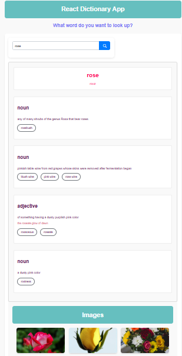

# react-dictionary-app

## 📌 Description
The React Dictionary App is a simple and interactive dictionary web application built using React. It allows users to search for word definitions and view related images, providing a seamless and informative experience.

## 🛠 Prerequisites
N/A

## 📋 Criteria
* Search for word definitions using the SheCodes Dictionary API
* Fetch related images from the SheCodes Images API
* Displays phonetic pronunciation of words
* Provides word synonyms for better understanding
* Provides word meanings for better understanding
* Mobile-friendly and responsive design

## 💻 Technologies Used
The application is built with the following technologies:
* HTML
* CSS
*JavaScript
*React.js
*Axios (for API requests)

## 🚀 Installation
No installation is required to use the app. It is hosted online and can be accessed via a web browser.

## 📚 Usage
1. Open the application in your browser.
2. Enter a word in the search box and press enter.
3. View word definitions, phonetics, examples, and synonyms.
4. See related images for the searched word.

## 🔗 Live Demo & Repository
Application can be viewed here: 
* [Live](https://ya-react-dictionary-project.netlify.app/)

* [Repository](https://github.com/yvonnesarah/react-dictionary-project)

## 🖼 Screenshot(S)
Below is a preview of React Dictionary App:

## 👥 Credit
N/A

## 📜 License
This project is open-source. For licensing details, please refer to the LICENSE file in the repository.

## 📬 Contact
You can reach me at 📧 yvonneadedeji.sarah@gmail.com.

